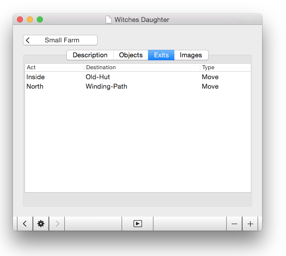

Quest for Mac
=============

Experimental Interactive Fiction editor/player for Mac.

Status
------

Can create rooms and descriptions, and exits that lead from one room
to the next.  Displays rooms and accepts button press commands to move
to a new room via an exit.  Starting to be a be interesting but not 
yet useful for a real game.

Background
----------

This project originally started out as an experiment in using Swift to
write a basic tool that would do interactive fiction rooms, and move
from room to room using HTML/CSS.  The game format was done using
markdown text files and the rooms were defined by preceding a block of
text (the room description) with a sub-heading (the room name) and
listing objects in the room as list items.  The project was basically a
mark-down parser, state-engine and HTML/CSS renderer.

Unfortunately the mark-down structure didn't scale beyond
rooms very well, and I started the current version (which has gone
through 2-3 iterations) to create a desktop app for Mac which could
edit structured data files.  At this point the goal became to build
something a bit like [Quest](https://github.com/textadventures/quest)
with a fuller-featured desktop app as the editor, and an integrated
player.

Goals
-----

The current project aims to be a full-featured game data file editor and
seperate players for Interactive Fiction.  The inspiration for the
project is Alex Warren's "Quest", which only runs on Windows.

Although I have called it Quest, after Alex's excellent and highly
successful project, I don't really plan to be able to read or edit the
.aslx files that Quest uses.  If the name turns out to be a source of
trouble or confusion I guess I can change it.

At present my project uses data files that are binary, and could be read
by an iOS app player.  As the player is basically a WebView with a
state-engine in Swift that is not platform specific creating the iOS
port should be very simple.

Although the rendering system is HTML/CSS and a theming engine is
planned, the state-engine is in Swift and thus creating a web-based
version is not immediately on the cards.

Screenshots
-----------

Click the disclosure triangle to edit the title of the game.  Click the
right-arrow to go ahead and edit the game content, via the rooms list.

List rooms by their names.  Each room also has to have a unique key
string, which needs to be a HTML-fragment safe string.  If you enter
letters in this key string field hyphens will be inserted automatically
by a formatter for illegal characters.  The plain-text (without the
hyphens) will be copied to the Room Name field.

Enter the description here for the room. 

Create links to other rooms.  These are one-way and specify the destination
room, the action type and name performed eg "move" and "North".

This is a screenshot of the Player application rendering a room, with its
title, description and buttons for the exits.

This shows the display of the Player, just after pressing a button for one
of the exits from a previous room.  The view for the new room is
displayed, and a dialog over the top of it details the action taken to
reach here.  When the dialog is dismissed the player view for the room
is revealed.
